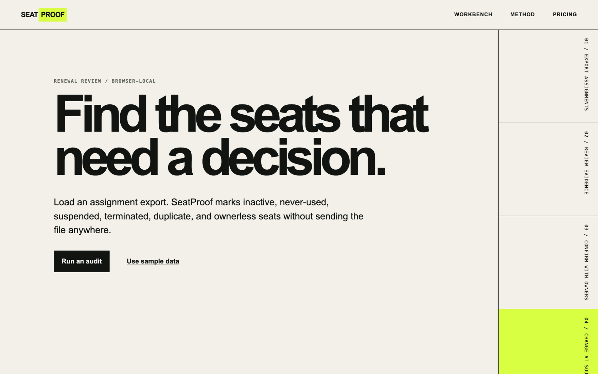

# SeatProof

SeatProof turns a SaaS license assignment CSV into a browser-local review queue before renewal.

It flags:

- assignments held by terminated workers;
- suspended paid seats;
- active seats with no last-active date;
- active seats past a configurable inactivity threshold;
- duplicate app and user pairs;
- assignments without a manager.

The workbench does not upload, persist, or revoke anything. Identifiers are masked on screen by default. Cost totals stay separated by currency and are described as estimates from supplied data.



## Run locally

```bash
pnpm install
pnpm dev
```

Open `http://localhost:3000`.

## CSV contract

Required columns:

```text
app,user_id,license_status,last_active_date,monthly_seat_cost,currency
```

Optional columns:

```text
department,manager,employment_status
```

Accepted license statuses are `active`, `suspended`, `inactive`, and `revoked`. Accepted employment statuses are `active`, `terminated`, `leave`, and `unknown`. Dates use `YYYY-MM-DD` and currencies use three-letter codes.

## Verify

```bash
pnpm verify
pnpm audit --prod
```

The full product boundary and evidence are in [docs/SPEC.md](docs/SPEC.md) and [docs/OPPORTUNITY.md](docs/OPPORTUNITY.md).

## Commercial status

The local workbench is free. No checkout is configured. Revenue and customer counts are unverified.

## Privacy

Source rows remain in page memory. Optional Plausible analytics receive event names only when a deployment owner configures `NEXT_PUBLIC_PLAUSIBLE_DOMAIN`; CSV content and counts are never event properties.

---

Built by [Uvin Vindula](https://iamuvin.com) · [ASI Research Labs](https://asiresearch.io)
